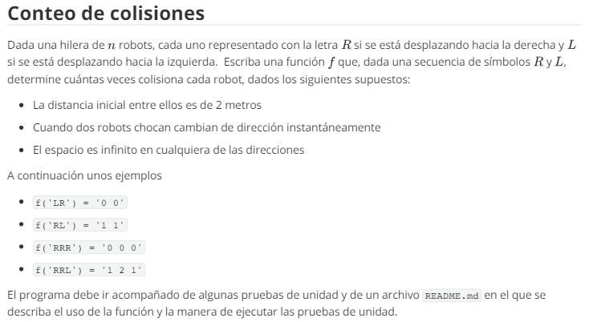
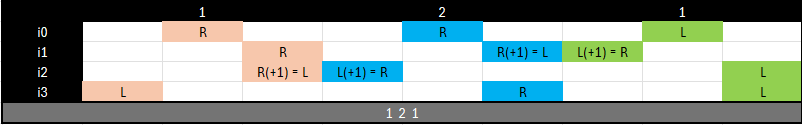
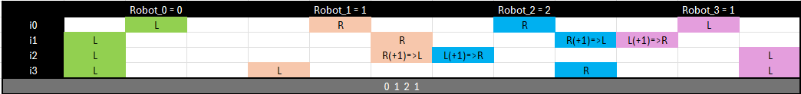
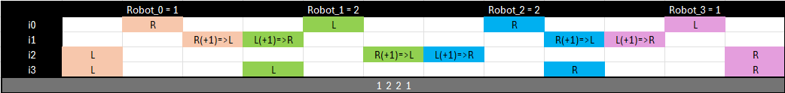
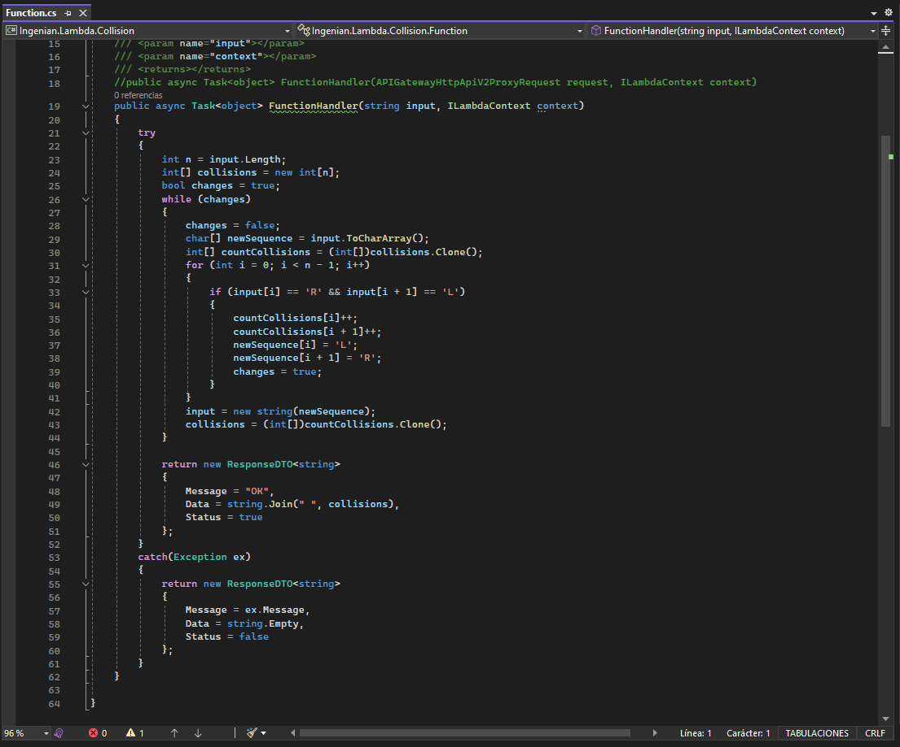
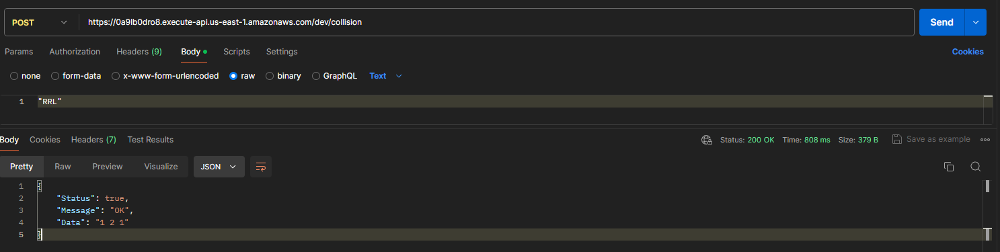
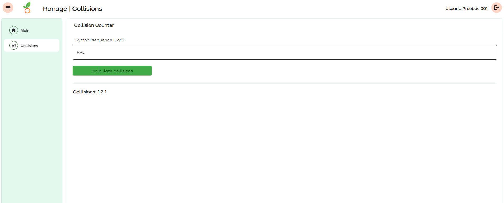

# Colisiones

Al revisar el planteamiento anterior, pude generar teorías de uso que fueron confirmadas con los resultados de los ejemplos planteados.

Para poder comprender a profundidad, realicé unos ejemplos de una manera un poco gráfica usando una hoja de Excel, lo cual me llevó a obtener los resultados esperados.

## Pruebas de entendimiento

De esta manera, comprendí que los robots tienen un movimiento inicial de un metro y, cuando encontraban otro robot, colisionaban, resultando en un cambio de dirección. Se movían un metro y otro metro adicional debido a la colisión. De esta manera, ya tenía el proceso completo para llevarlo a código.

Lo que hice luego fue llevar este proceso a código, lo cual fue plasmado en una función lambda en .NET Core 6 y C#. También fue desplegada en AWS y puede ser accedida mediante un API Gateway que configuré para ser accedida con un método POST.

## Código C# [Funcion Lambda]

## Petición de prueba

Finalmente, implementé el servicio en un frontend desarrollado en Angular. El resultado fue el siguiente:

