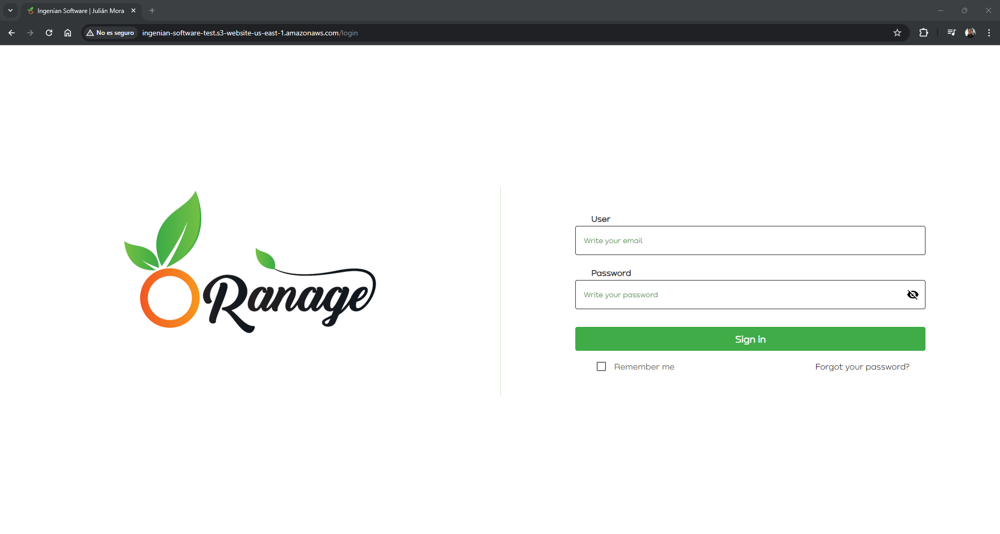
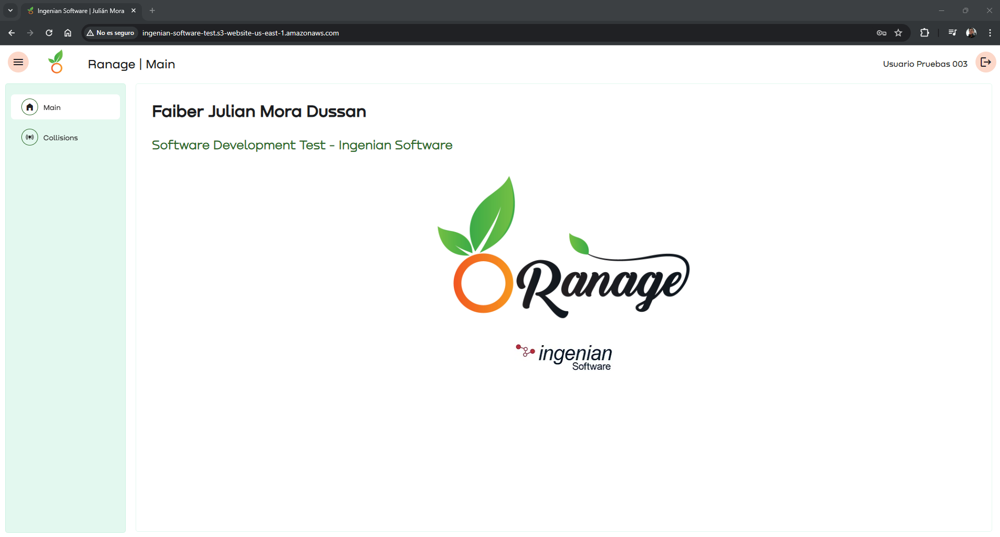
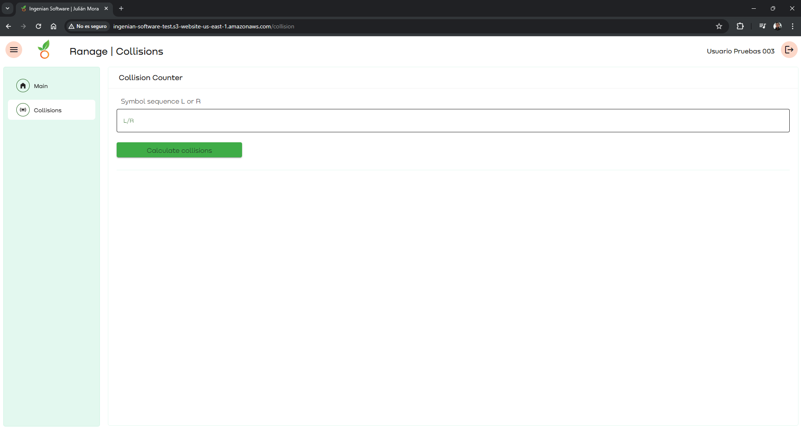

# Descripción de la propuesta gráfica

Realicé un proyecto en Angular v17 en el cual desarrollé la propuesta gráfica del login y una pantalla principal en la cual agregué el servicio que resuelve el problema del contador de colisiones.

La propuesta de diseño se basa en los colores de la imagen proporcionada. Traté de utilizar los colores de esta imagen sin que esté tan cargada, lo cual me llevó a algo simple pero funcional.

Luego de iniciar sesión, nos encontramos con un sitio que sigue la línea de colores usada en el login y que está en función de los colores del logo.

Al seleccionar la opción de Colisions, nos lleva a una pantalla donde podremos probar el servicio Lambda que resuelve el conteo de colisiones basado en una secuencia que el usuario puede ingresar en la caja de texto.